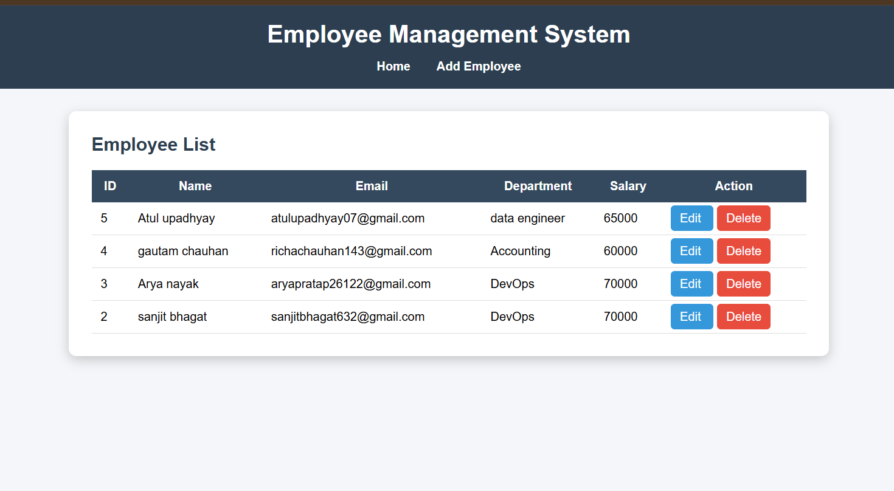
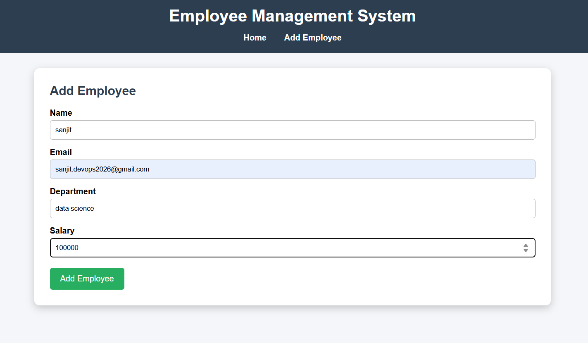
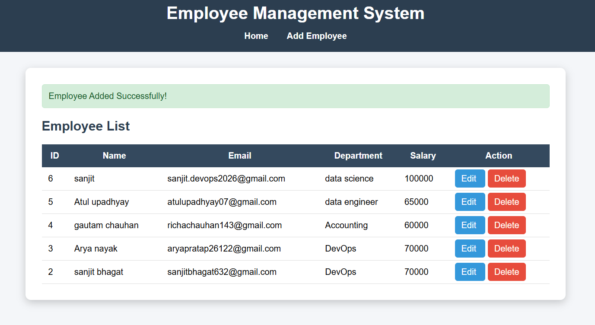

# Employee Management System

A simple Employee Management System built with **Flask** and **SQLite**. This application allows users to add, view, edit, and delete employee records through a clean web interface.

---

## Features

* Add new employees
* View all employees
* Update employee details
* Delete employee records
* SQLite database for data storage
* Responsive user interface using HTML and CSS
* Flash messages for successful operations

---

## Tech Stack

* Python
* Flask
* SQLite
* HTML5
* CSS3
* Git & GitHub
* AWS EC2 (Deployment)

---

## Project Structure

```text
employee-management/
│
├── app.py
├── database.py
├── requirements.txt
├── employee.db
├── README.md
│
├── templates/
│   ├── layout.html
│   ├── index.html
│   ├── add.html
│   └── edit.html
│
├── static/
│   └── style.css
│
└── screenshots/
```

---

## Installation

### Clone the repository

```bash
git clone https://github.com/YOUR_USERNAME/employee-management.git
cd employee-management
```

### Create a virtual environment

```bash
python -m venv venv
```

### Activate the virtual environment

**Windows**

```bash
venv\Scripts\activate
```

**Linux/macOS**

```bash
source venv/bin/activate
```

### Install dependencies

```bash
pip install -r requirements.txt
```

### Run the application

```bash
python app.py
```

Open your browser and visit:

```
http://127.0.0.1:5000
```

---

## AWS EC2 Deployment

1. Launch an Ubuntu EC2 instance.
2. Connect using SSH.
3. Install Python and Git.
4. Clone this repository.
5. Install the required packages.
6. Run the Flask application.
7. Configure the Security Group to allow port **5000**.
8. Access the application using:

```
http://YOUR_PUBLIC_IP:5000
```

---

## Screenshots
# Screenshots

## Home Page



---

## Add Employee



---

## Employee List



---

## Delete Confirmation


---

## Application Running on AWS EC2


## Future Improvements

* User Login & Authentication
* Employee Search
* Pagination
* File Upload
* Docker Support
* Nginx & Gunicorn Deployment
* CI/CD using GitHub Actions
* MySQL/PostgreSQL Integration

---

## Author

**Sanjit Bhagat**


---

